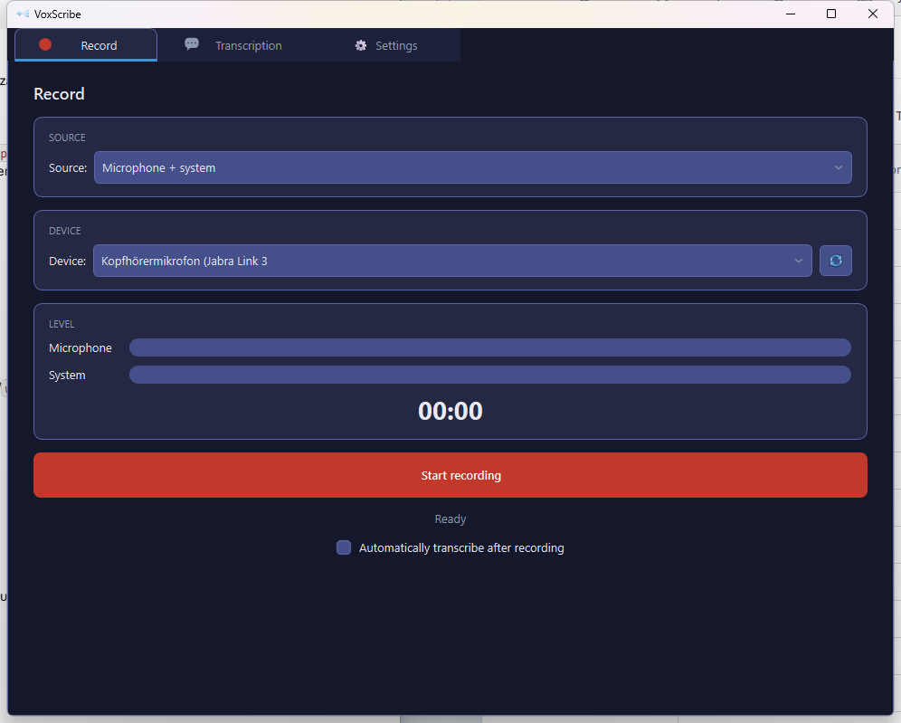

# VoxScribe

Local audio recording and transcription with [WhisperX](https://github.com/m-bain/whisperX). Record a meeting (microphone, system audio, or both), transcribe it with word-accurate timestamps and speaker labels, rename speakers once and have them recognized automatically next time, and export a clean transcript — all from one desktop app, with a CLI available for scripting the same pipeline.

Transcription uses your configured default [provider](docs/providers.md) if one is set up; if that's unreachable, it falls back automatically to the best local model for your hardware/platform. A local model can also be chosen explicitly, in which case the whole pipeline runs 100% locally after a one-time model download.



## Features

- **GUI** (PySide6/Qt) — Record, Transcription, Settings tabs
- **CLI** — full command-line control as an alternative to the GUI, see [CLI reference](docs/cli-reference.md)
- **Configurable providers** — add any OpenAI-compatible transcription endpoint (name, URL, API key, model) in Settings; local transcription (Whisper/WhisperX, Apple SpeechAnalyzer, Intel Arc GPU) always stays available as a fallback — see [Providers](docs/providers.md)
- **Microphone / system-audio / both at once** — full meeting recording (Windows; macOS implemented, system-audio experimental, combined mode not yet verified on real hardware)
- **Video files as input** — MKV, MP4, MOV, WebM, AVI transcribed directly, no ffmpeg needed
- **Multi-file transcription** — select several files at once, transcribed in sequence and merged into one continuous transcript
- **Local GPU acceleration** — CUDA (NVIDIA), Intel Arc GPU via OpenVINO (see [Intel Arc GPU](docs/intel-arc-gpu.md)), or Apple SpeechAnalyzer/Neural Engine on macOS
- **Speaker diarization & recognition** — color-coded, with voice-print-based automatic recognition across recordings
- **Word-level timestamps**, automatic language detection, TXT/SRT/JSON export

## Install

### Windows

```bash
# 1. Get the code
git clone https://gitlab.kit.edu/kit/ipek/acm/voxscribe.git
cd voxscribe

# 2. Install uv (if not already installed)
powershell -c "irm https://astral.sh/uv/install.ps1 | iex"

# 3. Install dependencies (creates .venv automatically, incl. CUDA PyTorch)
uv sync
```

`pyproject.toml` already pins `torch`/`torchaudio`/`torchvision` to the CUDA 12.8 index, so that's enough on a machine with an NVIDIA GPU. For an Intel Arc GPU instead, see [Intel Arc GPU](docs/intel-arc-gpu.md) — handled automatically at runtime either way.

### macOS / Linux

See [macOS setup](docs/macos.md). Linux is experimental (microphone-only, no system-audio path); `uv sync` is enough there too.

## HuggingFace token (for speaker diarization)

1. Create a token: https://huggingface.co/settings/tokens → **Read** access
2. Accept the model licenses:
   - https://huggingface.co/pyannote/speaker-diarization-3.1
   - https://huggingface.co/pyannote/segmentation-3.0
3. Add it to `.env`:
   ```
   HF_TOKEN=hf_xxxxxxxxxxxxxxxxxxxxx
   ```

After the first model download (~3 GB), everything runs fully offline (except when using a remote provider).

## Usage

### GUI

```bash
uv run python gui_qt.py
```

Three tabs: **Record** (source/device, live level, start/stop), **Transcription** (file picker, language/model/diarization, progress, speaker rename, export), **Settings** (providers, HuggingFace token, recording folder, performance). See [Providers](docs/providers.md) for setting up a transcription endpoint.

### CLI

```bash
uv run python main.py devices                      # list audio devices
uv run python main.py record --source mic           # record from microphone
uv run python main.py transcribe -i audio.wav        # transcribe a file
uv run python main.py run --source system            # record + transcribe
```

Full option reference: [docs/cli-reference.md](docs/cli-reference.md).

## Project structure

```
├── gui_qt.py                    # GUI entry point (PySide6/Qt) - thin, delegates to qt_app/
├── main.py                      # CLI entry point - thin, delegates to voxscribe/cli.py
├── download_models.py            # Thin entry point -> voxscribe/download_models.py
├── build_exe.py                  # Thin entry point -> voxscribe/build_exe.py
├── qt_app/                       # GUI code: main_window.py, controllers.py, theme.py, pages/, widgets/
├── voxscribe/                    # Backend package
│   ├── cli.py                     # CLI command implementations
│   ├── recorder.py                # Audio recording (microphone + WASAPI loopback/ScreenCaptureKit + combined)
│   ├── transcriber.py             # WhisperX/Apple SpeechAnalyzer transcription + alignment + diarization + provider models + video input
│   ├── providers.py               # Persistent transcription-provider configuration
│   ├── speaker_profiles.py        # Persistent speaker profiles (voice prints) for recognition
│   ├── hardware_detect.py         # GPU/CPU detection + model recommendation
│   ├── gpu_setup.py               # Automatic CUDA/XPU torch backend correction (Windows)
│   ├── download_models.py         # Pre-download models for offline/bundled operation
│   └── build_exe.py               # PyInstaller build for a standalone .exe (Windows)
├── macos/                        # macOS Swift helpers: SystemAudioCapture.swift, SpeechAnalyzerTranscribe.swift, build.sh
├── docs/                          # Detailed docs: providers, Intel Arc GPU, macOS, CLI reference
├── pyproject.toml                 # Python dependencies (incl. CUDA PyTorch pinning), primary source for `uv`
├── .env                           # HuggingFace token (not committed!)
└── recordings/                    # Recordings + transcripts
```

## Notes

- On first use, local models download from HuggingFace (~1-3 GB, depending on model). After that, everything runs offline unless using a remote provider.
- **Microphone + system** records both sources at once and mixes them.
- **System audio** captures whatever is playing through speakers/headphones — ideal for Teams/Zoom.
- The GUI stops recording via its button; the CLI stops on **ENTER** or **Ctrl+C**.
- Transcripts are saved in the `recordings/` folder.
- **Rename & remember speakers**: after transcription, rename SPEAKER_00 etc. to real names in the GUI. With "remember" checked, the voice is saved as a profile (`~/.voxscribe/speaker_profiles.json`) and recognized automatically in future recordings — this is a heuristic voice match, so occasional misassignments (especially on short/quiet segments) are possible and worth checking before saving.

## Corporate proxy / SSL

If SSL verification fails behind a corporate firewall, it's automatically disabled (configured in `main.py`). For `pip` installs, you may also need `--trusted-host pypi.org --trusted-host files.pythonhosted.org`.
